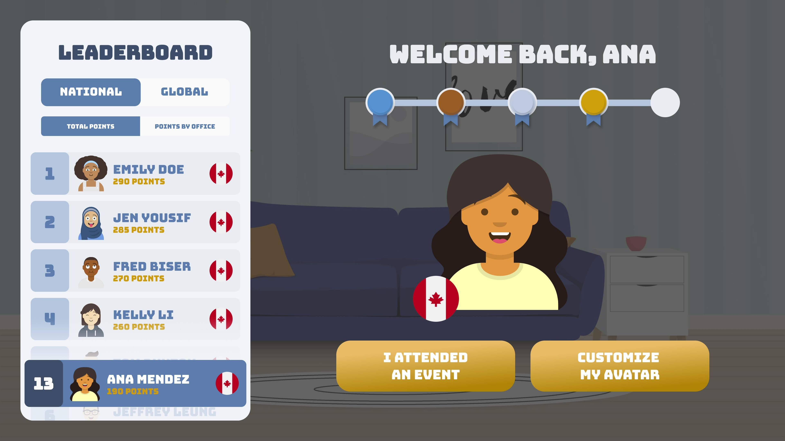

#  SAPatar


Virtual gamified engagement platform for iXp Interns to create and customize an avatar.



**React website** created with Redux and Bootstrap. It uses  the [SAPataaars](https://www.npmjs.com/package/sapataaars) npm library, an extension of the [avataaars](https://github.com/fangpenlin/avataaars) library.

**View** the website deployed on Netlify [here](https://musing-mestorf-0bba56.netlify.app/), and **learn more** about the project [here](https://youtu.be/HGdrZe228aw).

## Credits

This project was created by Tiffany Ren, Jane Chang, Cassey Peng, Priscilla Lee, Jordan Yep, [Zhi Guo](https://github.com/LeQuint), and [Jeffrey Leung](https://github.com/jleung51).

## Setup

First, install [Node.js](https://nodejs.org/en/download/).

Clone the repository:
```shel
git clone https://github.wdf.sap.corp/I535790/SAPatar
```

Install the necessary packages:
```shell
npm install
```

Start the server locally:
```shell
npm start
```

The website will be available on port 8080 (http://127.0.0.1:8080).